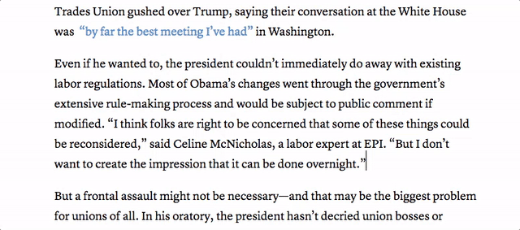

# The Atlantic's correction bookmarklet
Sometimes we make mistakes. Here's an easier way to insert corrections.

## How to use it
### Grab the bookmarklet
Go to [this page](https://s3.amazonaws.com/the-atlantic/corrections/index.html) and drag the bookmarklet to your toolbar.

### Move your cursor to where the error lived
Drop the typey-blinky line where you want to insert the correction, and click the bookmarklet. It'll drop in a asterisk and insert, if it doesn't already exist, a horizontal line and some correction starter text at the bottom of the page.

Type away. The `<a>` tags will link to each other.

### You can do this as many times as you need
It'll just drop another correction beneath the other one.

